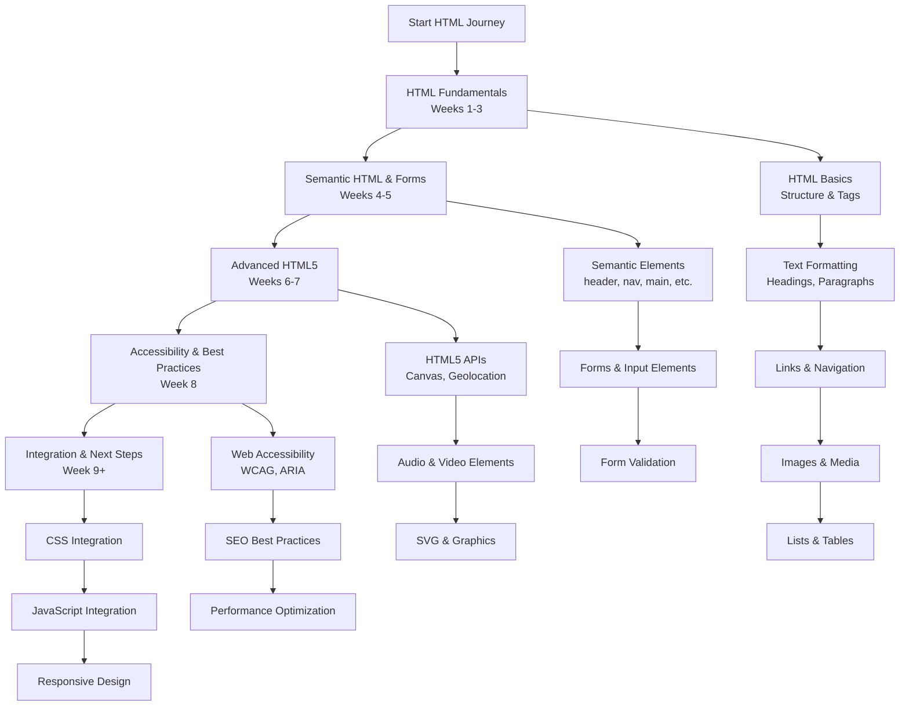

# HTML Developer Learning Path: A Structured Curriculum

This comprehensive roadmap provides a structured approach to mastering HTML development. The curriculum is designed sequentially, with each module building upon previous knowledge to ensure a solid foundation and progressive skill development.

---

## Phase 1: HTML Fundamentals (Weeks 1-3)

*   [**Module 1: Introduction to HTML & Web Development**](https://github.com/ahmadrizal1st/html-intro/#readme)
    *   HTML Overview: History, Purpose, and Role in Web Development
    *   Understanding Web Technologies: HTML, CSS, JavaScript Relationship
    *   Setting Up Development Environment: Text Editors (VS Code), Browsers
    *   Creating Your First HTML Page: Basic Structure and File Naming
    *   Viewing HTML Pages in Web Browsers

*   [**Module 2: HTML Document Structure & Basic Tags**](https://github.com/ahmadrizal1st/html-structure/#readme)
    *   HTML Document Anatomy: `<!DOCTYPE>`, `<html>`, `<head>`, `<body>`
    *   Essential Head Elements: `<title>`, `<meta>`, `<link>`, `<style>`
    *   HTML Syntax: Tags, Elements, and Attributes
    *   Comments in HTML: `<!-- Comment -->`
    *   HTML Validation and Standards Compliance

*   [**Module 3: Text Formatting & Content Structure**](https://github.com/ahmadrizal1st/html-text/#readme)
    *   Headings: `<h1>` to `<h6>` - Hierarchy and Importance
    *   Paragraphs and Text Blocks: `
` Element
    *   Text Formatting: `<strong>`, `<em>`, `<mark>`, `<small>`, ``, ``
    *   Line Breaks and Horizontal Rules: ` `, `
`
    *   Quotations: `<blockquote>`, `<q>`, `<cite>`
    *   Code and Preformatted Text: `<code>`, `<pre>`

*   [**Module 4: Links & Navigation**](https://github.com/ahmadrizal1st/html-links/#readme)
    *   Anchor Tag: `<a>` with `href` Attribute
    *   Types of Links: Absolute vs. Relative URLs
    *   Internal Page Navigation: Anchor Links with `#`
    *   Link Targets: `_self`, `_blank`, `_parent`, `_top`
    *   Email and Telephone Links: `mailto:`, `tel:`
    *   Navigation Menus: Unordered Lists with Links

*   [**Module 5: Images & Media Elements**](https://github.com/ahmadrizal1st/html-media/#readme)
    *   Image Element: `` with `src`, `alt`, `width`, `height` Attributes
    *   Image Formats: JPEG, PNG, GIF, SVG, WebP
    *   Responsive Images: `srcset` and `sizes` Attributes
    *   Figure and Figcaption: `<figure>`, `<figcaption>`
    *   Favicons: Linking with `<link rel="icon">`

*   [**Module 6: Lists & Tables**](https://github.com/ahmadrizal1st/html-lists-tables/#readme)
    *   Unordered Lists: `<ul>` with `<li>`
    *   Ordered Lists: `<ol>` with `<li>` (Types and Start Attributes)
    *   Description Lists: `<dl>`, `<dt>`, `<dd>`
    *   Table Structure: `<table>`, `<tr>`, `<td>`, `<th>`
    *   Advanced Tables: `<thead>`, `<tbody>`, `<tfoot>`, `colspan`, `rowspan`
    *   Table Accessibility: `scope` Attribute and Captions

---

## Phase 2: Semantic HTML & Forms (Weeks 4-5)

*   [**Module 7: Semantic HTML5 Elements**](https://github.com/ahmadrizal1st/html-semantic/#readme)
    *   Semantic vs. Non-semantic Elements
    *   Document Structure Elements: `<header>`, `<nav>`, `<main>`, `<footer>`
    *   Content Sectioning: `<section>`, `<article>`, `<aside>`
    *   Text-level Semantics: `<time>`, `<address>`, `
`, `
`
    *   Benefits of Semantic HTML: SEO, Accessibility, Maintainability

*   [**Module 8: HTML Forms & User Input**](https://github.com/ahmadrizal1st/html-forms/#readme)
    *   Form Element: `<form>` with `action`, `method`, `target` Attributes
    *   Input Types: `text`, `password`, `email`, `tel`, `url`, `number`, `date`
    *   Form Controls: `<input>`, `<textarea>`, `<select>`, `<button>`
    *   Advanced Input Types: `radio`, `checkbox`, `range`, `color`, `file`
    *   Form Organization: `<fieldset>`, `<legend>`, `<label>`
    *   Form Attributes: `required`, `placeholder`, `pattern`, `maxlength`

*   [**Module 9: Form Validation & Enhancement**](https://github.com/ahmadrizal1st/html-validation/#readme)
    *   HTML5 Form Validation: Built-in Validation Features
    *   Input Patterns: Regular Expressions with `pattern` Attribute
    *   Custom Validation Messages
    *   Form Submission Methods: GET vs. POST
    *   Data List Element: `<datalist>` for Auto-completion

---

## Phase 3: Advanced HTML5 Features (Weeks 6-7)

*   [**Module 10: HTML5 APIs & Multimedia**](https://github.com/ahmadrizal1st/html5-apis/#readme)
    *   Audio Element: `<audio>` with Multiple Source Formats
    *   Video Element: `<video>` with Controls, Autoplay, and Loop
    *   Canvas Element: `<canvas>` for Dynamic Graphics
    *   SVG Graphics: Inline SVG vs. External Files
    *   Introduction to HTML5 APIs: Geolocation, Local Storage, Drag & Drop

*   [**Module 11: Embedded Content & Iframes**](https://github.com/ahmadrizal1st/html-embedded/#readme)
    *   Iframe Element: `<iframe>` for Embedding External Content
    *   Embedding Maps, Videos, and Social Media Content
    *   Iframe Security: `sandbox` Attribute and Best Practices
    *   Object and Embed Elements: `<object>`, `<embed>`
    *   Embedding PDFs and Other Document Types

*   [**Module 12: Advanced Layout & Structure**](https://github.com/ahmadrizal1st/html-layout/#readme)
    *   Div and Span Elements: `
`, `` for Grouping and Styling
    *   HTML5 Semantic Layout Patterns
    *   Microdata and Structured Data: Schema.org Vocabulary
    *   Open Graph Protocol for Social Media Sharing
    *   Twitter Cards and Other Meta Tags

---

## Phase 4: Accessibility & Best Practices (Week 8)

*   [**Module 13: Web Accessibility (A11y)**](https://github.com/ahmadrizal1st/html-accessibility/#readme)
    *   Understanding Web Content Accessibility Guidelines (WCAG)
    *   ARIA Roles and Attributes: Enhancing Accessibility
    *   Semantic HTML for Screen Readers
    *   Keyboard Navigation and Focus Management
    *   Color Contrast and Visual Accessibility
    *   Alt Text for Images and Descriptive Links

*   [**Module 14: SEO & Performance Optimization**](https://github.com/ahmadrizal1st/html-seo/#readme)
    *   Search Engine Optimization Basics
    *   Meta Tags for SEO: Description, Keywords, Viewport
    *   Semantic HTML for Better SEO
    *   HTML Optimization: Minification and Compression
    *   Lazy Loading for Images and Iframes
    *   Preload, Prefetch, and Preconnect Hints

*   [**Module 15: HTML Best Practices & Standards**](https://github.com/ahmadrizal1st/html-best-practices/#readme)
    *   HTML5 Doctype and Character Encoding
    *   Proper Nesting and Indentation
    *   Cross-browser Compatibility Considerations
    *   Mobile-First Approach and Responsive Design Foundations
    *   HTML Validation Tools and Linters

---

## Phase 5: Integration & Next Steps (Week 9+)

*   [**Module 16: CSS Integration & Styling**](https://github.com/ahmadrizal1st/html-css/#readme)
    *   Linking CSS to HTML: `<link>` vs. `<style>` vs. Inline Styles
    *   CSS Selectors: Class, ID, Attribute, and Pseudo-classes
    *   Basic Layout Concepts: Display, Position, Flexbox, Grid
    *   Responsive Design with Media Queries
    *   CSS Frameworks Introduction: Bootstrap, Tailwind CSS

*   [**Module 17: JavaScript Integration**](https://github.com/ahmadrizal1st/html-javascript/#readme)
    *   Adding JavaScript to HTML: `<script>` Tag
    *   DOM Manipulation Basics
    *   Event Handling: Click, Submit, Change Events
    *   Form Validation with JavaScript
    *   Modern JavaScript Frameworks Overview

*   [**Module 18: Capstone Project & Advanced Paths**](https://github.com/ahmadrizal1st/html-capstone/#readme)
    *   **Build a Complete Multi-page Website**
    *   **Implement Responsive Design Principles**
    *   **Ensure Full Accessibility Compliance**
    *   **Choose a Specialization Path:**
        *   **Frontend Development:** Advanced CSS, JavaScript Frameworks (React, Vue, Angular)
        *   **Full-Stack Development:** Backend Integration, Databases, Server-side Rendering
        *   **Web Accessibility Specialist:** Advanced A11y Techniques and Auditing
        *   **UI/UX Design:** Design Systems, User Research, Prototyping
